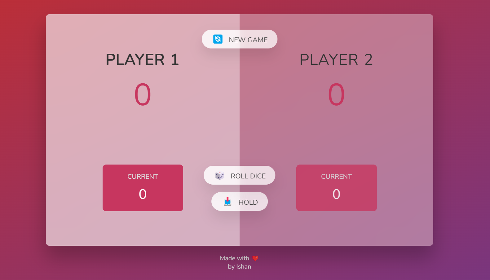
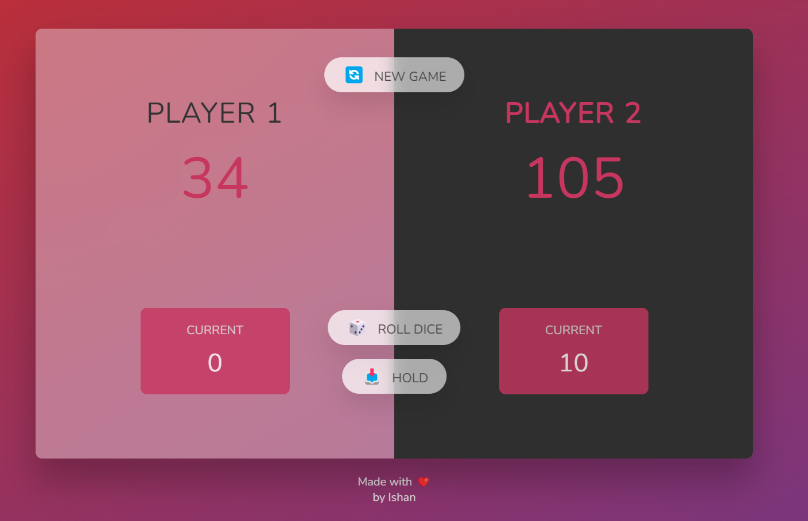

# Dice Game

This is a simple dice game implemented using HTML, CSS, and JavaScript.

## Overview

The dice game is a two-player game where each player takes turns to roll a dice and accumulate points. The first player to reach a specified winning score wins the game.

## Game Rules

- The game is played by two players, taking alternating turns.
- On each turn, a player rolls a dice by clicking the "Roll Dice" button.
- The number rolled on the dice gets added to the player's current score.
- If a player rolls a 1, their current score is lost, and it becomes the other player's turn.
- A player can choose to "Hold" their current score, adding it to their total score. Then it becomes the other player's turn.
- The first player to reach the winning score (e.g., 100 points) wins the game.
- Click the "New Game" button to start a new game.

## Functionality

- **Roll Dice:** Click the "Roll Dice" button to roll the dice and accumulate points. If a 1 is rolled, the current score is lost.
- **Hold:** Click the "Hold" button to save the current score and switch to the other player's turn.
- **New Game:** Click the "New Game" button to start a new game.

## How to Play

1. Clone or download the repository.
2. Open the `index.html` file in your web browser.
3. Follow the on-screen instructions to play the game.
4. Enjoy the game and have fun!

## Screenshots 

## Contributions

Contributions to improve the game functionalities or add new features are welcome! Feel free to fork the repository, make changes, and create a pull request.

## Acknowledgments

This project was made possible thanks to the following resources:

- [Angela Yu](https://www.appbrewery.co/): For providing an insightful course on web development that helped in understanding JavaScript concepts.
- [MDN Web Docs](https://developer.mozilla.org/): For their comprehensive documentation on web technologies that was instrumental in building this project.
- Various YouTube tutorials: [JS Mastery](https://www.youtube.com/@javascriptmastery)

These resources have been invaluable in learning and implementing the concepts used in this project.

## License

This project is licensed under the [MIT License](https://opensource.org/licenses/MIT) - see the [LICENSE](LICENSE) file for details.

